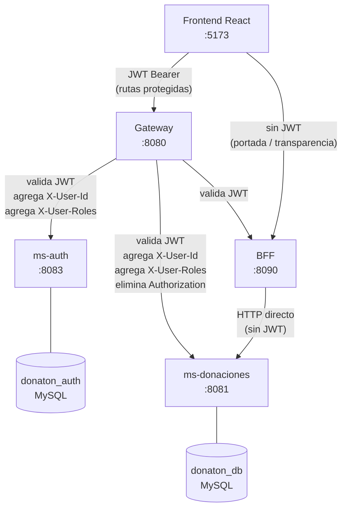

# Arquitectura de Microservicios — Donaton

## Diagrama



## Servicios

| Servicio | Puerto | Tecnología | Responsabilidad |
|---|---|---|---|
| `donaton-frontend` | 5173 | React 19 + Vite + Tailwind | UI del usuario: causas, donaciones, testimonios, mapa |
| `donaton-gateway` | 8080 | Spring Cloud Gateway | Punto de entrada único: valida JWT, propaga claims, rate limiting |
| `donaton-ms-auth` | 8083 | Spring Boot 3 + Spring Security | Registro, login, generación de JWT, gestión de usuarios y roles |
| `donaton-ms-donaciones` | 8081 | Spring Boot 3 + JPA | Causas, donaciones, testimonios, transparencia |
| `donaton-bff` | 8090 | Spring Boot 3 + WebClient | Agrega datos para la portada y transparencia del frontend |

## Flujo de autenticación

```
1. Usuario POST /auth/login  →  Gateway  →  ms-auth
2. ms-auth valida credenciales, retorna { token, email, nombre, rol }
3. Frontend guarda token en localStorage
4. Siguiente request: FE → Gateway con "Authorization: Bearer <token>"
5. Gateway llama JwtAuthFilter: valida firma + expiración
6. Si válido: agrega X-User-Id y X-User-Roles al request, propaga al downstream
7. El downstream (ms-donaciones) confía en esos headers (GatewayAuthFilter)
```

## Flujo de una donación

```
1. Usuario (autenticado) POST /api/donaciones
2. Gateway valida JWT → agrega X-User-Id, X-User-Roles
3. Gateway retransmite a ms-donaciones :8081 (elimina Authorization header)
4. ms-donaciones lee X-User-Id del header para asociar al donante
5. Persiste en donaton_db
6. Responde 201 Created con la donación creada
```

## Flujo de lectura de portada (BFF)

```
1. Frontend GET /bff/portada  (sin JWT — ruta pública)
2. Gateway deja pasar  →  BFF :8090
3. BFF llama internamente a ms-donaciones :8081 para obtener causas activas,
   top donadores y estadísticas (SIN pasar por el gateway)
4. BFF agrega y transforma los datos
5. Responde con PortadaResponseDTO al frontend
```

## Seguridad

- **JWT**: HMAC-SHA256, firmado en ms-auth, validado en Gateway con la misma clave
- **Rutas públicas** (no requieren JWT):
  `/auth/login`, `/auth/register`, `/bff/portada`, `/bff/transparencia`,
  `/api/causas`, `/api/testimonios`, `/api/donaciones/ultimas`,
  `/api/donaciones/transparencia`, `/api/donaciones/top`,
  `/api/donaciones/total`, `/api/donaciones/count`
- **Rate limiting**: 50 req/min por IP (Bucket4j, en memoria)
- **CORS**: solo `http://localhost:5173` en desarrollo

## Persistencia de datos

Ver [persistencia.md](./persistencia.md).

## Pruebas unitarias

Ver [pruebas-unitarias.md](./pruebas-unitarias.md).
